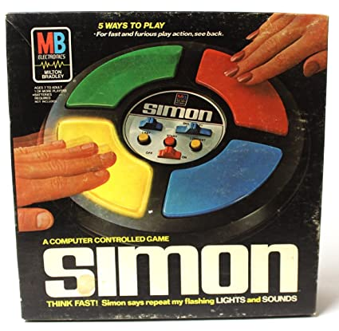

# Simmon-Game
This is an interactive Simon Game written in VanillaJS/CSS/HTML to simulate the classic Simon Electronic Memory Game.

Each level will have different set(s) of button blink, player must follow the order of how the button blink and click the corresponding button in order. If all buttons were click correctly, player will enter next level and have a more complex set of challenge as the game reaches to higher levels.

